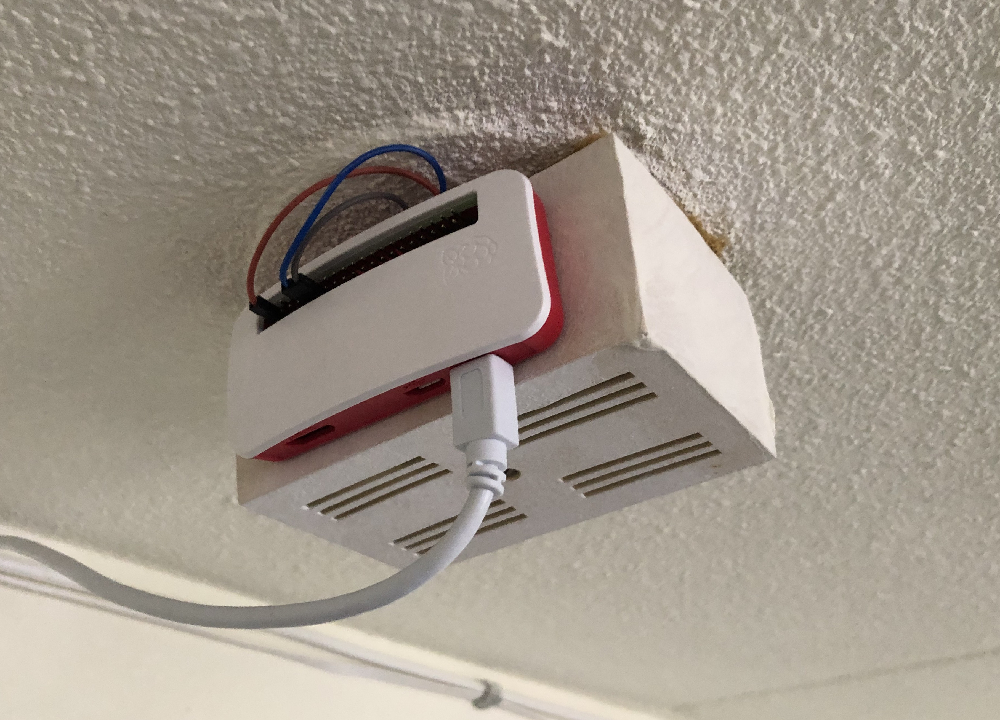

# 🔔 Smart doorbell running on a Raspberry Pi Zero W.

My apartment building has an old-school analog doorbell system. Using some small components, a Raspberry Pi Zero W and a bit of Python I was able to digitalize my doorbell. I recieve pushover notifications when someone rings the doorbell. Ideal for when my music is on 100% or if I'm not at home and can alert a roommate so he or she can open the door for a delivery.



## Making the hardware
This specific schematic is designed specifically for my own apartment. It is however possible that this schematic will work for your own use case. My doorbell is an oscillating electromagnet, but as long as your doorbell makes an electric circuit when someone rings the bell it should work.


## Installing the software
This Python script was created for the Raspberry Pi Zero W running on Debian/Raspbian 9 (stretch).

```shell
git clone https://github.com/lesander/doorbell.git
cd doorbell/
pip install -r requirements.txt
cd ../
python3 doorbell
```

I make use of [`pm2`](http://pm2.keymetrics.io/) to transform the Python script to a daemon. For this to work you'll need node and npm.

```shell
npm install pm2
sudo pm2 startup systemd -u pi --hp /home/pi
pm2 start python3 doorbell
pm2 save
```

